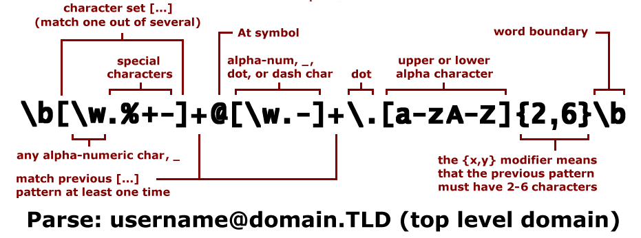

# regular expression

Regular expressions, also known as regex or regexp, are a sequence of characters that form a search pattern. They are used to match and manipulate strings of text. Regular expressions are used in programming languages, text editors, and command-line tools for tasks such as pattern matching, string parsing, and data validation. They provide a concise and flexible way to search, match, and manipulate text based on certain patterns or rules.

Regular expressions consist of literal characters and special characters called metacharacters. Metacharacters have special meanings and are used to define the pattern rules. Some common metacharacters include:

. (dot): Matches any single character except a newline.
* (asterisk): Matches zero or more occurrences of the preceding character or group.
+ (plus): Matches one or more occurrences of the preceding character or group.

? (question mark): Matches zero or one occurrence of the preceding character or group.

[] (square brackets): Matches any single character within the brackets.

() (parentheses): Groups characters together and creates a capture group.

\ (backslash): Escapes a metacharacter or denotes a special sequence.

\d: Matches any digit (0-9).

\w: Matches any word character (a-z, A-Z, 0-9, and underscore).

\s: Matches any whitespace character (space, tab, newline, etc.).

^: Matches the start of a string.

$: Matches the end of a string.

Regular expressions can be used in various programming languages, such as Python, JavaScript, Java, and many others. They allow you to perform powerful string manipulation and search operations by defining complex patterns to match against text.


The sed command in Linux is a stream editor used to perform text transformations on input streams, such as files or output from other commands. It allows you to search for specific patterns and replace or delete them, among other operations. sed uses regular expressions to define the patterns to match and the actions to perform. Would you like to see an example of how to use the sed command?

```
cp /etc/ssh/sshd_config
sed "s/yes/no/g" sshd_config --> without saving
sed -i "s/yes/no/g" sshd_config --> with saving
sed -i "63,75s/yes/no/g" sshd_config --> save and in line 63 to 75
sed -i "89s/yes/no/g" sshd_config --> replace just in one line
sed -i -e "/PasswordAuthentication/s/yes/no/g" sshd_config --> replace all line with PasswordAuthentication
sed "s/\/etc\/ssh\/ssh_known_hosts/\/home\/milad/g" sshd_config == "s|/etc/ssh/ssh_known_hosts|/home/milad|g" --> change delimiter
sed -n "7,15p" sshd_config --> just for show 
sed "s/yes/$VAR1/g" sshd_config
```

Replace a specific string in a file:

```
sed 's/foo/bar/g' input.txt > output.txt
```

Delete lines matching a pattern:

```
sed '/foo/d' input.txt > output.txt
```
In-place editing of a file:

```
sed -i 's/foo/bar/g' input.txt
```

