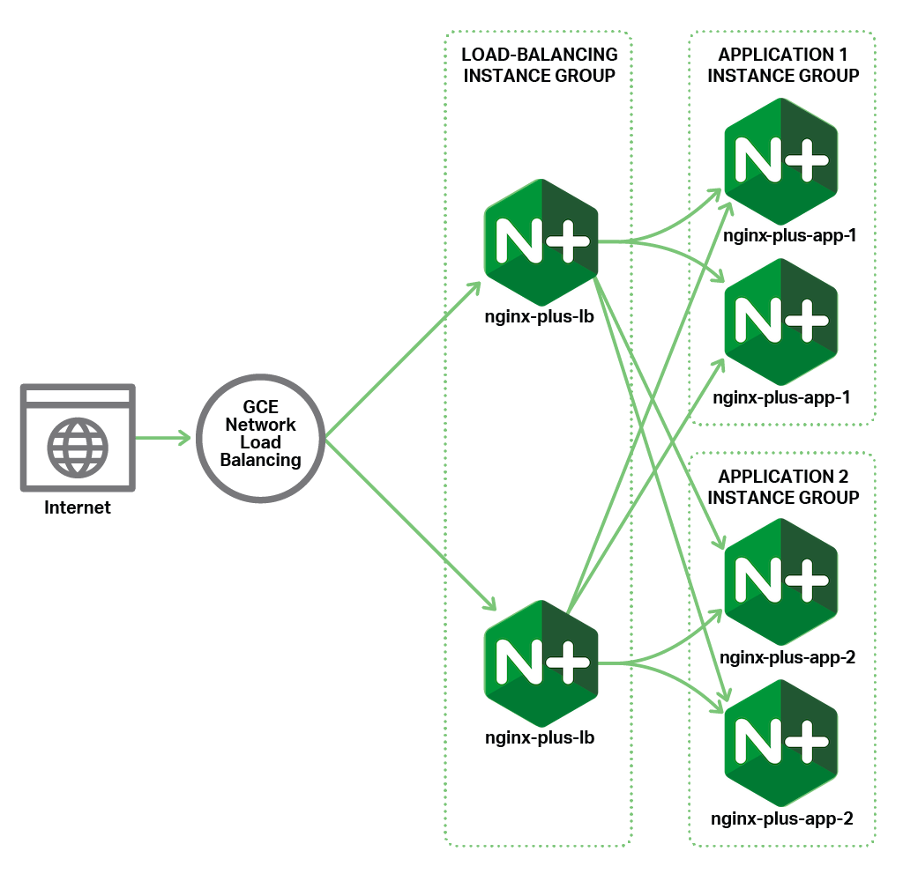

# Nginx

Nginx (pronounced as "engine-x") is a popular open-source web server software. It is known for its high performance, stability, rich feature set, simple configuration, and low resource consumption. Nginx was originally designed to solve the C10k problem, which is handling 10,000 concurrent connections, and it achieves this with an event-driven, asynchronous architecture.

Here are some key aspects of Nginx:

* Web Server: Primarily, Nginx is used as a web server for serving static content efficiently and also as a reverse proxy for HTTP, HTTPS, SMTP, POP3, and IMAP protocols.

* Load Balancer: It can be used as a load balancer to distribute network or application traffic across many servers to improve the reliability and scalability of applications.

* Reverse Proxy: As a reverse proxy, Nginx can direct requests to appropriate backend servers, providing an additional layer of abstraction and control to ensure smooth flow of network traffic between clients and servers.

* Caching & Compression: Nginx supports caching of content and compression, which enhances the performance by reducing the load times for returning visitors and reducing bandwidth usage.

### Install and configure

Installing Nginx on Ubuntu is a straightforward process. You can use the package manager apt to install Nginx. Here's a step-by-step guide:

Update Software Repositories:
First, it's always a good idea to update your package list to ensure you're getting the latest version of packages.

```bash
sudo apt update
```

Install Nginx:
Next, install Nginx using apt.

```bash
sudo apt install nginx
```

Checking your Web Server:
Once installed, Nginx will start automatically. You can check the status of the Nginx service with:

```bash
sudo systemctl status nginx
```

Accessing your Web Server:
You can access the default Nginx landing page to confirm that the software is running properly. Open your web browser and navigate to your server's domain name or public IP address.

```
http://your_server_domain_or_IP/
```

Managing the Nginx Service:
You can manage the Nginx service with systemctl. Here are some basic commands:

```bash
sudo systemctl stop nginx

sudo systemctl start nginx

sudo systemctl restart nginx

sudo systemctl reload nginx

sudo systemctl disable nginx

sudo systemctl enable nginx
```

Configuration Files:
Nginx's configuration files are stored in /etc/nginx. The main configuration file is /etc/nginx/nginx.conf. For site-specific configurations, you can use the /etc/nginx/sites-available directory, and enable sites by creating a symbolic link to them within the /etc/nginx/sites-enabled directory.

Testing Configuration:
After making changes to Nginx's configuration, you should test to make sure there are no syntax errors in any of your Nginx files:

```bash
sudo nginx -t
```


### Nginx as a reverse proxy


Configuring Nginx as a reverse proxy involves setting up Nginx to forward requests for a specific domain or path to another server. This is commonly used for load balancing, caching, or to serve dynamic content from an application server behind Nginx. Here's a basic guide to setting up Nginx as a reverse proxy:

Edit Nginx Configuration:
Open the configuration file for your site in the /etc/nginx/sites-available/ directory. If you're setting this up on a fresh Nginx install, you can modify the default configuration file:

```bash
sudo unlink /etc/nginx/sites-enabled/default
sudo vim /etc/nginx/sites-available/reverse.conf
```

Alternatively, you can create a new configuration file for your domain in the sites-available directory and then enable it by creating a symbolic link to it in the sites-enabled directory.

Configure the Reverse Proxy:
Inside the server block, you need to add a location block. This is where you will specify the server to which you want to forward requests. Below is an example configuration:

```nginx
server {
	listen 80;
	server_name  _;

	access_log /var/log/nginx/reverse-access.log;
	error_log /var/log/nginx/reverse-error.log;

	location /app1 {
		proxy_pass http://172.16.0.11:5000/;
		#proxy_http_version  1.1;
		#proxy_cache_bypass  $http_upgrade;

		#proxy_set_header Upgrade           $http_upgrade;
		#proxy_set_header Connection        "upgrade";
		#proxy_set_header Host              $host;
		#proxy_set_header X-Real-IP         $remote_addr;
		#proxy_set_header X-Forwarded-For   $proxy_add_x_forwarded_for;
		#proxy_set_header X-Forwarded-Proto $scheme;
		#proxy_set_header X-Forwarded-Host  $host;
		#proxy_set_header X-Forwarded-Port  $server_port;
	}
	location /app2 {
		proxy_pass http://172.16.0.11:5000/;
	}
}
```

`proxy_pass` specifies the address of the proxied server and the URI to which a request will be forwarded.
`proxy_set_header` directives are used to pass client request headers to the proxied server.

Testing the Configuration:
After you have made your changes, test to make sure there are no syntax errors in your Nginx configurations:

```bash
sudo nginx -t
```

Link to site:
Create a symbolic link to your site's configuration file in the sites-enabled directory.

```bash 
ln -s /etc/nginx/sites-available/reverse.conf /etc/nginx/sites-enabled/reverse.conf
```

Restart Nginx:
Once you have verified your configuration is correct, restart Nginx to apply the changes:

```bash
sudo systemctl restart nginx
```



### Nginx as a load balancer


Configuring NGINX as a load balancer involves a few steps to set it up to distribute incoming network traffic across multiple servers. This can improve the responsiveness and availability of applications by spreading the load. Here's a basic guide to get you started:

### 1. Install NGINX

Ensure that NGINX is installed on your system. If it's not installed, you can usually install it via your operating system's package manager. For example, on Ubuntu/Debian systems, you can use:

```bash
sudo apt update
sudo apt install nginx
```

For CentOS/RHEL systems:

```bash
sudo yum install epel-release
sudo yum install nginx
```

### 2. Configure NGINX as a Load Balancer

Once NGINX is installed, you need to configure it to act as a load balancer. This involves editing the NGINX configuration file, typically found at `/etc/nginx/nginx.conf` or `/etc/nginx/sites-available/default` depending on your system.

You'll want to modify the `http` block to include an `upstream` section, where you define the server pool that will handle the requests, and a `server` section to define how to handle incoming requests.

Here's an example configuration:

```nginx
http {
    upstream myapp {
        server backend1.example.com;
        server backend2.example.com;
        server backend3.example.com;
    }

    server {
        listen 80;

        location / {
            proxy_pass http://myapp;
            proxy_set_header Host $host;
            proxy_set_header X-Real-IP $remote_addr;
            proxy_set_header X-Forwarded-For $proxy_add_x_forwarded_for;
            proxy_set_header X-Forwarded-Proto $scheme;
        }
    }
}
```

vim /etc/nginx/sites-available/lb.conf

```nginx
upstream myapp {
	server 172.16.0.11;
	server 172.16.0.12;
}

server {
	listen 80;
	location / {
		proxy_pass http://myapp;
	}
}
```

```bash
ln -s /etc/nginx/sites-available/lb.conf /etc/nginx/sites-enabled/lb.conf
```

In this example, `myapp` is the name of the upstream group consisting of three servers (`backend1.example.com`, `backend2.example.com`, and `backend3.example.com`). NGINX will balance the load among these servers when requests come in on port 80.

### 3. Choose a Load Balancing Method

NGINX supports several methods of load balancing:

- **Round-robin** (default): Requests are distributed evenly across the servers, with the next request going to the top of the list.
- **Least connected**: Requests are sent to the server with the fewest active connections.
- **IP hash**: Requests from the same client IP address are sent to the same server.

You can specify the method in the `upstream` block. For example, to use the least connected method:

```nginx
upstream myapp {
    least_conn;
    server backend1.example.com;
    server backend2.example.com;
    server backend3.example.com;
}
```

### 4. Test and Reload NGINX Configuration

After making changes, test your NGINX configuration for syntax errors:

```bash
sudo nginx -t
```

If everything is ok, reload NGINX to apply the changes:

```bash
sudo systemctl reload nginx
```

### 5. Monitor and Adjust

After your load balancer is up and running, you'll want to monitor its performance and the health of your backend servers. You may need to adjust the configuration or add/remove servers from the pool to handle the load effectively.

This setup gives you a basic NGINX load balancer. Depending on your needs, you might want to explore more advanced features and settings, such as SSL/TLS termination, sticky sessions, or integrating health checks.


Resources:

https://docs.nginx.com/nginx/admin-guide/web-server/reverse-proxy/
https://medium.com/@miladev95/nginx-a0391c5cf6dd
https://www.theserverside.com/blog/Coffee-Talk-Java-News-Stories-and-Opinions/How-to-setup-Nginx-reverse-proxy-servers-by-example
https://www.digitalocean.com/community/tutorials/how-to-configure-nginx-as-a-reverse-proxy-on-ubuntu-22-04


https://docs.nginx.com/nginx/admin-guide/load-balancer/http-load-balancer/
https://upcloud.com/resources/tutorials/configure-load-balancing-nginx
https://www.digitalocean.com/community/tutorials/how-to-set-up-nginx-load-balancing