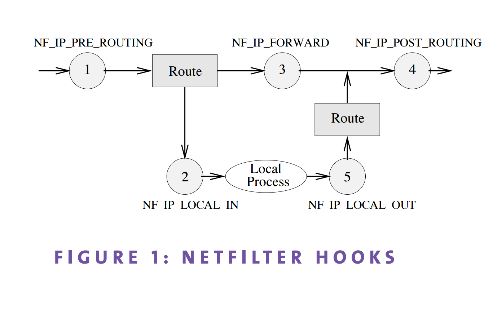

# nftables

nftables is a tool that can help you to manage your firewall. it's a `netfilter` framework.

In kernel and nftables we have a object called `hook` that is a point in the packet processing where we can attach rules.

The hooks are:
- `NF_IP_PRE_ROUTING`: before routing decision (for destination nat and so on)
- `NF_IP_LOCAL_IN`: for packets destined to local sockets (designated for local linux like ssh, httpd and so on)
- `NF_IP_FORWARD`: for packets being routed through the machine (like a router)
- `NF_IP_POST_ROUTING`: for packets leaving the machine (after routing decision, src nat and so on)
- `NF_IP_LOCAL_OUT`: for packets generated locally (like answers to ping, or http requests)

nftables is a replacement for `iptables`, `ip6tables`, `arptables` and `ebtables`. It uses a single tool to manage both IPv4 and IPv6 rules.

### Packet flow

If packet want to route through the machine it goes through `NF_IP_PRE_ROUTING`, `NF_IP_FORWARD` and `NF_IP_POST_ROUTING` hooks.(for example linux is a router)

If packet is destined to local machine it goes through `NF_IP_PRE_ROUTING`, `NF_IP_LOCAL_IN` hooks.(for example ssh connection to the machine)

If packet is generated locally it goes through `NF_IP_LOCAL_OUT` and `NF_IP_POST_ROUTING` hooks.(for example answer to ping or a http request)



**nftables can work in `data link layer`, `network layer` and `transport layer`. you can filter packets based on mac address, ip address and port.**


### Tables

Tables are containers for chains for packets filtering. you can create multiple tables for different protocols. for example you can create a table for `ip` protocol and another table for `ip6` protocol. you can also create a table for `bridge` protocol.

**In nftables we don't have any tables by default. you have to create them manually**

Ok, let's jump to terminal and practice nftables :)

Install nftables package:

```bash
sudo apt install nftables
```

`man nft` to see nftables manual.

To see example configuration files:

```bash
dpkg -L nftables | grep examples
```

#### To work with nftables we have three ways:

- `script file`: you can create a script file and load it with `nft -f <file>` (cat /etc/nftables.conf) and then you can use `nft list ruleset` to see the rules.
- `command line`: you can use `nft` command to manage your firewall. for example `nft add table ip filter` to create a table named filter for ip protocol or `nft add ...`.
- `interactive mode`: you can use `nft -i` command to enter interactive mode and then you can type commands to manage your firewall.

#### nftables address families

`nft` has different address families:
- `ip`: for ipv4 protocol
- `ip6`: for ipv6 protocol
- `inet`: for both ipv4 and ipv6 protocols
- `arp`: for arp protocol
- `bridge`: for bridge protocol
- `netdev`: for netdev protocol (for ingress filtering)

Let's look at the default configuration of nftables:

```bash
root@gw:~# nft list ruleset
table inet filter {
	chain input {
		type filter hook input priority filter; policy accept;
	}

	chain forward {
		type filter hook forward priority filter; policy accept;
	}

	chain output {
		type filter hook output priority filter; policy accept;
	}
}
root@gw:~# 
```

For print the priority as number use `-y` option:

```bash
root@gw:~# nft -y list ruleset
table inet filter {
	chain input {
		type filter hook input priority 0; policy accept;
	}

	chain forward {
		type filter hook forward priority 0; policy accept;
	}

	chain output {
		type filter hook output priority 0; policy accept;
	}
}
root@gw:~# 
```

