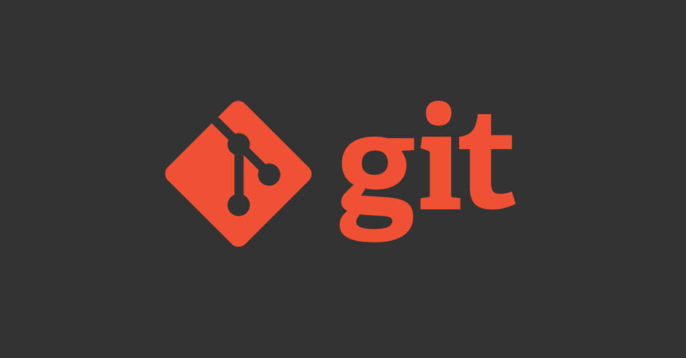

# Git

Git is a distributed version control system that allows multiple developers to collaborate on a project. It tracks changes to files and directories over time, allowing you to revert to previous versions if needed. Git provides features like branching and merging, which make it easier to work on different features or bug fixes simultaneously. It also allows you to work offline and then synchronize your changes with a remote repository when you have an internet connection.

Git was created by `Linus Torvalds`, the same person who created the Linux operating system. He initially developed it in 2005 to manage the source code of the Linux kernel.

Git is a widely used version control system that offers several benefits:

* Easy Collaboration: Git allows multiple developers to work on the same project simultaneously. It enables easy collaboration by providing features like branching, merging, and conflict resolution.

* Version control: Git tracks changes to your codebase, allowing you to easily revert to previous versions if needed. It provides a complete history of all changes made, including who made them and when.

* Branching and merging: Git allows you to create branches to work on new features or experiments without affecting the main codebase. Once the changes are ready, you can merge them back into the main branch.

* Backup and recovery: By using Git, your codebase is stored both locally and remotely. This provides an additional layer of backup, making it easier to recover from accidental code loss or hardware failures.

* Code sharing: Git provides platforms like GitHub, GitLab, and Bitbucket that allow you to easily share your code with others. These platforms also provide additional collaboration features like issue tracking and code reviews.

