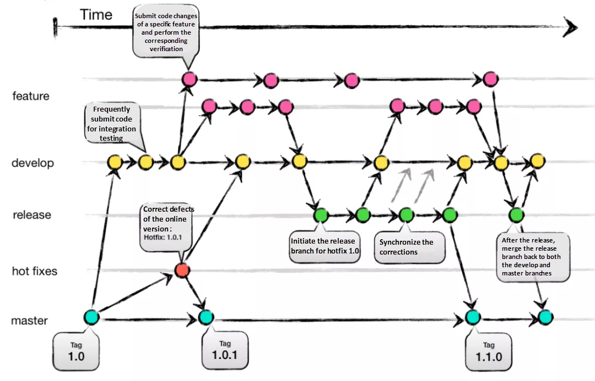

### Git branch

In Git, a branch is a lightweight movable pointer to a commit. It is used to track the progress of different lines of development. Branches in Git are useful for creating new features, bug fixes, or experiments without affecting the main codebase. You can create, switch between, merge, and delete branches in Git.

To create a new branch in Git, you can use the git branch command followed by the name of the new branch. Here's the syntax:

```bash
git branch <branch_name>
git branch feature-branch
```

After creating the branch, you can switch to it using the `git checkout` command:

```bash
git checkout feature-branch
```

Alternatively, you can create and switch to a new branch in a single command using the `-b` flag:

```bash
git checkout -b feature-branch
```

