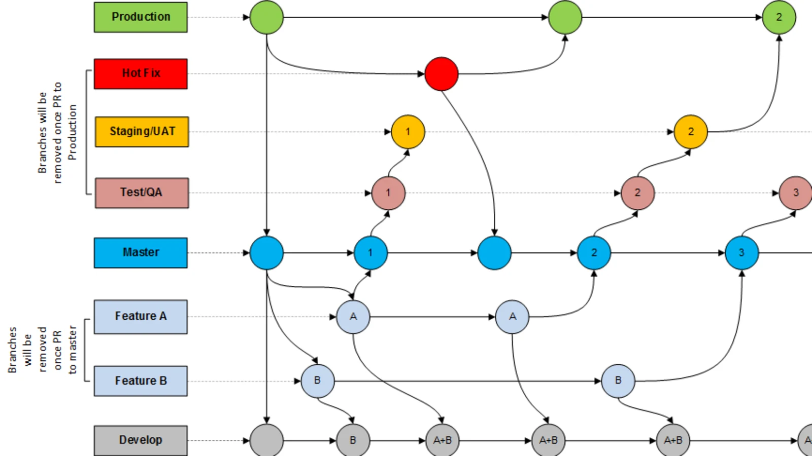

### git status

`git status` is a command used in Git version control system. It displays the current state of your working directory and staging area. It shows which files have been modified, added, or deleted since the last commit. It also shows if there are any untracked files.

### git add

`git add` is a command used in Git to add changes from the working directory to the staging area. It allows you to selectively choose which changes you want to include in the next commit.

```bash
$ git add .
```

### git commit

`git commit` is a command used in Git to create a new commit with the staged changes.

```bash
$ git commit -m "Commit message"
```

### git log

`git log` is a command used in Git to view the history of commits. It displays the changes made by each commit.

```bash
$ git log
```

### git diff

`git diff` is a command used in Git to view the differences between two commits.

```bash
$ git diff HEAD
```

```bash 
$ git diff --staged
```

To unstage changes after using the `git add` command, you can use the `git reset` command, you can use the git reset command with the specific file(s) or directory you want to unstage. Here's an example:

```bash
$ git reset file1.txt
```

If you want to unstage all changes at once, you can use the git reset command without specifying any file:

```bash
$ git reset
```

After running the `git reset` command, you can use the `git add` command, the changes you added with git add will be removed from the staging area, but the modifications to the file(s) will still be preserved in your working directory.

### git branch

In Git, a branch is a lightweight movable pointer to a commit. It is used to work on different versions of a codebase simultaneously. Each branch represents an independent line of development. When you create a branch, you can make changes to your code without affecting the main branch (usually called the "master" branch). Branches are useful for implementing new features, fixing bugs, and experimenting with different ideas.

`git branch` is a command used in Git to create a new branch. It creates a new branch in the repository and switches to it.

In Git, the "main" branch is typically the default branch that is created when you initialize a new repository. It is commonly referred to as the "master" branch, although some projects have started to use alternative names like "main" or "mainline" to avoid any potential racial or exclusionary connotations associated with the term "master".

```bash
$ git branch
```

```bash
$ git branch new-branch
```

```bash
$ git checkout new-branch
```

### git merge

`git merge` is a command used in Git to merge two or more branches into one.

In Git, the `git merge` command is used to combine changes from one branch into another. It allows you to integrate changes made in a source branch into a target branch.

When you run `git merge`, Git will look at the commit history of both branches and automatically merge the changes together. If there are any conflicts between the branches (i.e., if the same lines of code were modified in both branches), Git will notify you and ask you to manually resolve the conflicts.

Here's an example of how to use git merge:

```bash
# Switch to the target branch
git checkout target_branch
git checkout master

# Merge changes from the source branch
git merge source_branch
git merge development_branch
```


