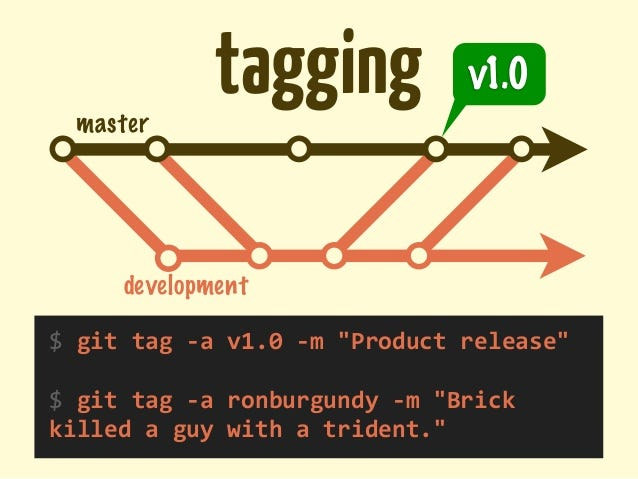

### Tag and version

`git tag` and `git tag -a` is a Git command used to manage tags in a repository. Tags are references to specific points in Git history, usually used to mark important milestones such as releases. They can be useful for versioning, documentation, and identifying specific commits in a repository.

```bash
git tag -a v1.0.0 -m "Tagging version 1.0.0"
```

```bash
git log
git tag -a v0.5.5. commit_id
git tag v1.0.0 abcd1234
```
The git tag -l command is used to list all the tags in a Git repository. It displays a list of all the tags that have been created in the repository.

Here's an example:

```bash
$ git tag -l
v1.0.0
v1.1.0
v1.2.0
```

```bash
$ git tag -l "v*"
v1.0.0
v1.1.0
v1.2.0
```

To view the details of a specific Git tag, you can use the `git show` command followed by the tag name. Here's how you can show the details of a tag:

```bash
$ git show v1.0.0
```

To push a Git tag to the "origin" remote repository, you can use the git push command with the tag name. Here's how you can push a tag to the "origin" remote:

```bash
$ git push origin v1.0.0
```

To checkout to a specific version or commit in Git, you can use the `git checkout` command followed by the commit hash, tag name, or branch name. Here's how you can checkout to a specific version:

```bash
$ git checkout v1.0.0
```

### Git blame

`git blame` is a Git command that shows the author and last modification details of each line in a file. It helps you determine who made a specific change to a line of code or when a change was made.

```bash
$ git blame file
```

To use `git blame` for a specific line in a file, you can specify the line number along with the file name. Here's how you can do it:

```bash
$ git blame -L <line_number>,<line_number> <file>
```