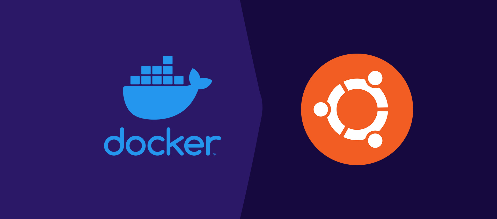

# Docker Version

There are two main variants of Docker:

1. **Docker Community Edition (CE)**: This is the free version of Docker, intended for developers and DIY enthusiasts. It's ideal for individual developers and small teams looking to get started with Docker and containerization.

2. **Docker Enterprise Edition (EE)**: This is a premium version of Docker designed for enterprise needs. It offers additional features like advanced management, security features, and support options for larger organizations.

Each of these variants receives regular updates. It's common to see multiple updates within a year, adding features, fixing bugs, and patching security vulnerabilities.

To find the latest version of Docker as of now (December 2023), you would need to check Docker's official website or their GitHub repository. Docker also provides detailed release notes for each version, outlining new features, improvements, bug fixes, and known issues, which can be found on their website or in their documentation. 

For the most current information on Docker's version, it's recommended to visit [Docker's official website](https://www.docker.com/) or refer to their [GitHub repository](https://github.com/docker).

## Install Docker Engine on Ubuntu 22.04

To install Docker on Ubuntu 22.04, you can follow these steps. Remember that you need to have sudo privileges to perform these operations.

### Step 1: Update Software Repositories
Before installing any new software, it's a good practice to update your package list:

```bash
sudo apt-get update
```

### Step 2: Install Required Packages
Install packages that allow `apt` to use packages over HTTPS:

```bash
sudo apt-get install ca-certificates curl gnupg
```

### Step 3: Add Docker’s Official GPG Key
This ensures the software you're installing is authenticated:

```bash
sudo install -m 0755 -d /etc/apt/keyrings
curl -fsSL https://download.docker.com/linux/ubuntu/gpg | sudo gpg --dearmor -o /etc/apt/keyrings/docker.gpg
sudo chmod a+r /etc/apt/keyrings/docker.gpg
```

### Step 4: Set up the Stable Repository
You need to set up the Docker repository to get Docker from the official Docker source:

```bash
echo \
  "deb [arch=$(dpkg --print-architecture) signed-by=/etc/apt/keyrings/docker.gpg] https://download.docker.com/linux/ubuntu \
  $(. /etc/os-release && echo "$VERSION_CODENAME") stable" | \
  sudo tee /etc/apt/sources.list.d/docker.list > /dev/null
```

### Step 5: Update Software Repositories Again
After adding Docker’s repository, update your package list again:

```bash
sudo apt-get update
```

### Step 6: Install Docker CE (Community Edition)
Now you can install Docker:

```bash
sudo apt-get install docker-ce docker-ce-cli containerd.io docker-buildx-plugin docker-compose-plugin
```

### Step 7: Verify Docker Installation
To ensure Docker was installed correctly, you can run the Docker Hello World image:

```bash
sudo docker run hello-world
```

This command downloads a test image and runs it in a container. If the installation was successful, the command will print a "Hello from Docker!" message.

### Step 8: Manage Docker as a Non-Root User (Optional)
By default, running the `docker` command requires administrator privileges. To run Docker commands without `sudo`, add your user to the `docker` group:

```bash
sudo usermod -aG docker ${USER}
```

To apply this new group membership, log out and then log back in, or you can type the following:

```bash
su - ${USER}
```

### Step 9: Enable Docker to Start on Boot (Optional)
To automatically start Docker when you boot your machine:

```bash
sudo systemctl enable docker
```

### Step 10: Checking Docker Version (Optional)
To check the installed Docker version:

```bash
docker --version
```

That's it! Docker should now be installed and ready to use on your Ubuntu 22.04 system. Remember that these steps require an internet connection and might take some time depending on your connection speed.