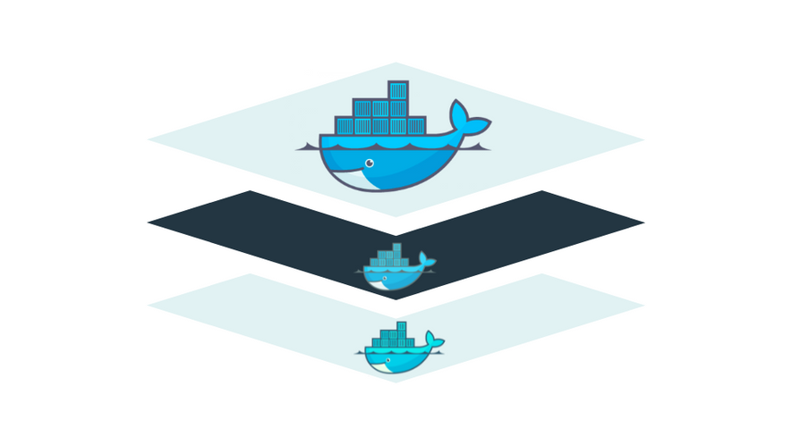
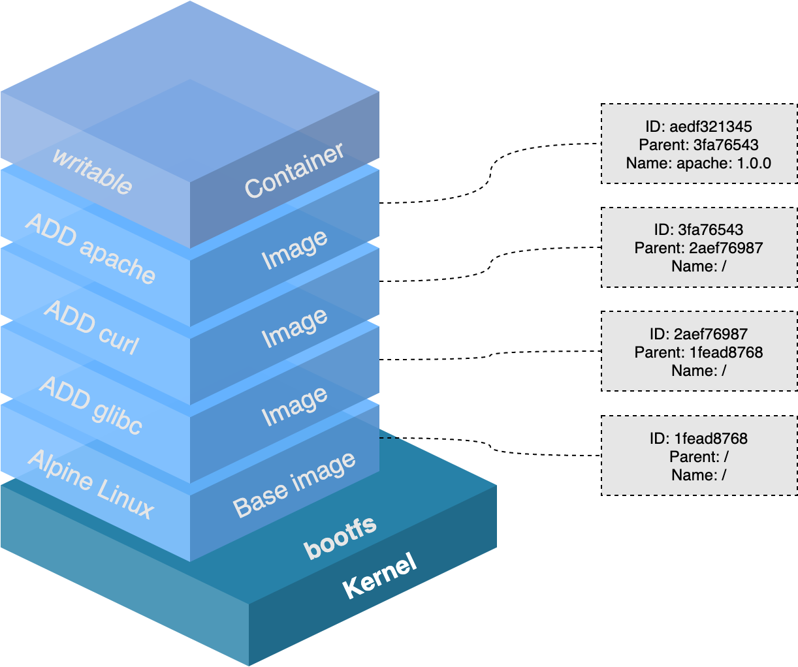

### Docker Images

Docker images are the basis of containers in Docker, which is a platform for developing, shipping, and running applications. Here's a breakdown of what Docker images are and their role in the Docker ecosystem:

1. **Definition**: A Docker image is a lightweight, standalone, and executable package that includes everything needed to run a piece of software, including the code, runtime, libraries, environment variables, and configuration files.

2. **Blueprint for Containers**: Docker images act as blueprints for creating containers. When you run a Docker image, it becomes a container, which is a runtime instance of the image. This means you can run multiple containers from the same image.

3. **Layers and Efficiency**: Docker images are composed of layers of file systems. Each layer represents an instruction in the image's Dockerfile. Layers are cached and reused across multiple images, which makes building and sharing images more efficient. When an image is updated, only the layers that changed are updated, saving storage space and reducing download times.

4. **Dockerfile**: The creation of a Docker image starts with a Dockerfile. This is a text file containing a series of instructions on how to build the image. It specifies the base image to use, software to install, files to add, commands to run, and other configuration details.

5. **Registries and Repositories**: Docker images are stored and distributed through registries. The most popular public registry is Docker Hub. Registries can be public or private, and they host repositories. A repository is a collection of Docker images, usually different versions of the same application.

6. **Portability**: One of the key advantages of Docker images is their portability. You can run a Docker image on any machine that has Docker installed, regardless of the underlying operating system or hardware. This eliminates the "it works on my machine" problem, making it easier to develop and deploy applications consistently across different environments.

In summary, Docker images are essential components in the Docker ecosystem, providing a portable, efficient, and consistent way to package and distribute applications for easy deployment and scaling.

### docker image layers

Docker image layers are a fundamental part of the Docker image architecture. Each layer represents a set of changes or additions to the image. Here's a detailed explanation:

1. **Layered File System**: Docker uses a union file system to build up an image. Each instruction in a Dockerfile creates a new layer in the image:

   - **Base Layer**: The first layer of a Docker image is the base layer, corresponding to the base image specified in the Dockerfile (e.g., `FROM ubuntu:18.04`). This base image is usually a minimal operating system or a scratch layer (empty layer for creating the smallest possible images).

   - **Subsequent Layers**: Each subsequent command in the Dockerfile adds a new layer on top of the base layer. For example, commands like `RUN`, `COPY`, `ADD`, and `ENV` each create a new layer.

2. **Layer Caching and Sharing**: Docker caches each layer. When you build an image, Docker checks if it has already created a layer from a specific instruction and reuses it if possible. This caching mechanism speeds up the image-building process. Layers are also shared across different images, which saves disk space. If two images are built from the same base image, they'll share the base layer on the host system.

3. **Read-Only Layers**: Each layer is immutable and read-only. When Docker runs a container, it adds a read-write layer on top of the image (known as the container layer) where all changes to the container (like writing new files, modifying existing files, and deleting files) are stored. This separation ensures that the underlying image remains unchanged and can be used to start new containers in a clean state.

4. **Efficiency in Distribution and Storage**: Because layers are shared and reused, distributing images and storing them is efficient. When you pull an image from a registry, Docker only downloads the layers that are not already present on the system.

5. **Layer Squashing**: While layers provide many benefits, too many layers can increase the size of an image. Sometimes, it's useful to "squash" layers together to reduce the number of layers and the overall size of the image. However, this comes at the cost of losing the benefits of layer caching and sharing.

In summary, Docker image layers are a series of read-only file system layers that represent the instructions in the Dockerfile. They are crucial for the efficiency, portability, and scalability of Docker containers, allowing for quick deployment and minimal storage usage.
