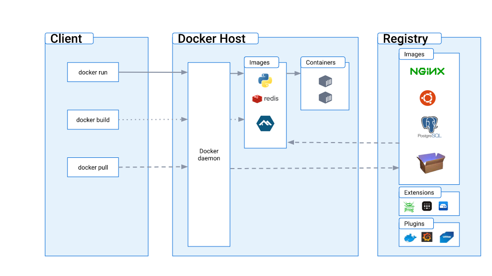

## Docker container

A Docker container is a lightweight, standalone, executable package that includes everything needed to run a piece of software, including the code, a runtime, libraries, environment variables, and configuration files. Docker containers are built from Docker images, which are templates that define the container's contents and behaviors.

#### Docker Run == docker pull + create + start

The `docker run` command is versatile and can be used in many different ways depending on your needs. Here are several examples to illustrate various use cases:

1. **Running a Container Interactively**:
   ```bash
   docker run -it ubuntu /bin/bash
   ```
   This command runs an Ubuntu container and gives you an interactive shell (`/bin/bash`) inside it. The `-it` option makes the container start in interactive mode with a tty.

2. **Running a Container with Environment Variables**:
   ```bash
   docker run -e MY_VAR=myvalue my-image
   ```
   Here, the `-e` flag is used to set an environment variable `MY_VAR` with the value `myvalue` in the container created from `my-image`.

3. **Running a Container with a Volume**:
   ```bash
   docker run -v /my/host/folder:/my/container/folder my-image
   ```
   This mounts the host directory `/my/host/folder` to `/my/container/folder` in the container. Changes to this directory are reflected in both the container and the host.

4. **Running a Container on a Specific Network**:
   ```bash
   docker run --network=my-network my-image
   ```
   This runs a container on a user-defined network `my-network`, allowing it to communicate with other containers on the same network.

5. **Running a Container with a Specific Hostname**:
   ```bash
   docker run --hostname=my-container my-image
   ```
   Sets the hostname of the container to `my-container`.

6. **Running a Container with Custom CPU and Memory Constraints**:
   ```bash
   docker run --cpus=1.5 --memory=512m my-image
   ```
   Limits the container to 1.5 CPUs and 512 megabytes of RAM.

7. **Running a Container and Removing it After Exit**:
   ```bash
   docker run --rm my-image
   ```
   The `--rm` flag automatically removes the container file system upon exit.

8. **Running a Container in Detached Mode with a Name**:
   ```bash
   docker run -d --name my-background-container my-image
   ```
   Runs the container in detached mode (in the background) and names it `my-background-container`.

9. **Running a Container and Publishing Multiple Ports**:
   ```bash
   docker run -p 80:80 -p 443:443 nginx
   ```
   Maps both port 80 and 443 from the container to the same ports on the Docker host, useful for running a web server like Nginx.

10. **Running a Container with a Read-Only File System**:
    ```bash
    docker run --read-only my-image
    ```
    Starts a container where the file system is read-only, which can improve security by preventing changes to system files.

These examples demonstrate how `docker run` can be used in various scenarios. Depending on your specific use case, you might combine several of these options in a single command. Remember, each Docker image might have its specific requirements and supported options, so always refer to the documentation for the images you are using.


### Docker rm

The `docker rm` command is used to remove one or more Docker containers. It's important to note that only stopped containers can be removed. If you try to remove a running container, you will encounter an error unless you use the `-f` (force) flag, which will stop and then remove the container.

Here's a basic example of the `docker rm` command:

```bash
docker rm my-container
```

In this example, `my-container` is the name or ID of the container you want to remove. You can find the name or ID of your containers by using the `docker ps -a` command, which lists all containers (running and stopped).

Here are a few more examples with different options:

1. **Removing Multiple Containers**:
   ```bash
   docker rm container1 container2 container3
   ```
   This command will remove containers named `container1`, `container2`, and `container3`.

2. **Force Removing a Running Container**:
   ```bash
   docker rm -f running-container
   ```
   The `-f` or `--force` option will stop a running container and then remove it.

3. **Remove a Container Upon Exit**:
   You can also set a container to be automatically removed when it stops by using the `--rm` flag with `docker run`, like so:
   ```bash
   docker run --rm my-image
   ```
   In this case, the container will be removed automatically when it exits. This is useful for keeping your system clean if you frequently create and dispose of temporary containers.

Remember to use the `docker rm` command with caution, especially with the `-f` flag, as removing containers is irreversible and any data not stored in a volume will be lost.

