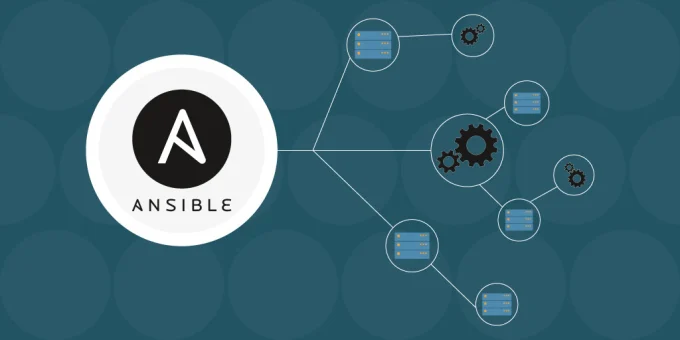

## What is Ansible?

Ansible® is an open source, command-line IT automation software application written in Python. It can configure systems, deploy software, and orchestrate advanced workflows to support application deployment, system updates, and more.

## How Ansible works

In Ansible, there are two categories of computers: the control node and managed nodes. The control node is a computer that runs Ansible. There must be at least one control node, although a backup control node may also exist. A managed node is any device being managed by the control node.

Ansible works by connecting to nodes (clients, servers, or whatever you're configuring) on a network, and then sending a small program called an Ansible module to that node. Ansible executes these modules over SSH and removes them when finished. The only requirement for this interaction is that your Ansible control node has login access to the managed nodes. SSH keys are the most common way to provide access, but other forms of authentication are also supported.

## Why use Ansible?

Ansible is a powerful tool used for automation in IT environments, and it offers several advantages:

1. **Simple to Learn and Use**: Ansible uses a simple syntax written in YAML, called Playbooks. These Playbooks are easy to write, read, and understand, making the automation process more transparent and accessible.

2. **Agentless Architecture**: Unlike other automation tools, Ansible doesn’t require any special agent software to be installed on the nodes it manages. It works by connecting to nodes using SSH (or PowerShell for Windows), which reduces the overhead and complexity on the managed systems.

3. **Powerful and Flexible**: Ansible can automate complex multi-tier IT application environments. It has modules for managing a wide variety of tasks, from system configuration to deploying software, and can work with a variety of operating systems.

4. **Efficient Orchestration**: With Ansible, you can easily model complex workflows, making it possible to manage dependencies and orchestrate the various steps of any process, including infrastructure provisioning, application deployment, and configuration management.

5. **Customization and Extensibility**: Ansible allows custom modules to be written in any language that can return JSON. This extensibility makes it adaptable for many different environments and use cases.

6. **Idempotency**: An important feature of Ansible is that it's idempotent, meaning you can run the same Playbook multiple times without affecting the system's state if it’s already in the desired state.

7. **Large Community and Support**: Being open-source and widely used, Ansible has a large community. This ensures continuous improvement, availability of a wide range of modules, and support through community forums.

8. **Security and Compliance**: Ansible can enforce security policies and compliance across the IT infrastructure, ensuring that systems are compliant with company or regulatory standards.

9. **Integration with Other Tools**: Ansible integrates well with other DevOps tools and systems, allowing for seamless workflows across different stages of IT environment management.

10. **Cost-Effective**: As an open-source tool, Ansible is free to use, which can lead to significant cost savings, especially for large-scale deployments.

These features make Ansible a popular choice for IT automation, configuration management, and application deployment across varied environments.

## How Ansible connects to managed nodes

Ansible connects to managed nodes using a variety of methods, depending on the operating system and environment of the nodes. The most common methods are:

1. **SSH (Secure Shell) for Linux/Unix nodes**: 
   - For most Unix-like systems, Ansible connects over SSH. 
   - It uses SSH to connect to the nodes and execute the tasks. 
   - No agent is required on the managed node. 
   - Ansible by default manages machines over SSH. It uses native OpenSSH and needs to have an SSH key or password to authenticate to the managed nodes. 
   - SSH keys are the recommended way for Ansible to authenticate to nodes.

2. **PowerShell for Windows nodes**: 
   - For Windows systems, Ansible uses PowerShell remoting. 
   - Initially, you need to set up PowerShell remoting on the Windows host, and Ansible communicates over WinRM (Windows Remote Management).
   - This is slightly different from the Linux/Unix mechanism and usually involves more setup on the Windows host.

3. **Parameter Specification in Ansible Playbooks**: 
   - When writing playbooks, you specify the connection type and credentials.
   - This can include specifying the SSH key or user and password, the specific port to use, and other connection-related parameters.

4. **Inventory File**: 
   - Ansible keeps track of all of the servers that it manages through an inventory file. 
   - This file contains information about the nodes including their IP addresses or hostnames, and can also include variables that define the connection type or credentials to use for each node.

5. **Ansible.cfg Configuration File**: 
   - Ansible's behavior can be modified with settings in the `ansible.cfg` file. 
   - You can set defaults for the SSH connection, such as the private key file, user name, port, and other connection parameters.

6. **Privilege Escalation**: 
   - Ansible can use privilege escalation methods such as `sudo` or `su` to execute tasks that require higher privileges. 
   - This is particularly useful for tasks that need administrative permissions on the managed nodes.

7. **Network Devices**: 
   - For network devices, Ansible uses various connection methods, like `network_cli`, `netconf`, or `httpapi`, depending on the device and the nature of the task.

8. **Cloud Services**: 
   - For managing instances in cloud services, Ansible can use APIs provided by the cloud provider. 

The ability of Ansible to use standard, existing protocols and systems like SSH and WinRM means there's no need to install and maintain additional software on the nodes it manages, simplifying the process and reducing the maintenance overhead.

