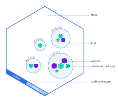

# Pod

In Kubernetes, a Pod is the smallest and most basic unit. It represents a single instance of a running process in a cluster. A Pod can contain one or more containers, which are tightly coupled and share the same network and storage resources. Containers within a Pod can communicate with each other using localhost.

Pods are designed to be ephemeral, meaning they can be created, destroyed, and replaced as needed. They are scheduled onto Nodes (servers) in the cluster by the Kubernetes scheduler.

Pods provide a layer of abstraction for managing containers and enable scaling, load balancing, and self-healing capabilities in Kubernetes.

## Command

```bash
kubectl run nginx --image=nginx

kubectl run nginx --image=nginx --port=80 --restart=Never
```

### Static pod

In Kubernetes, a static pod is a type of pod that is managed directly by the Kubelet, the component responsible for running containers on a node, without the need for the Kubernetes API server. Static pods are created and managed by the Kubelet, even if the API server is not running or is not accessible.

Static pods are useful in certain scenarios where you need to run a pod on a node without relying on the Kubernetes control plane. They are typically used in edge cases or for troubleshooting purposes.

Static pods are created by placing a pod specification file in the `/etc/kubernetes/manifests/` directory on the node. The Kubelet automatically detects and starts these pods when it starts. Static pods do not have a lifecycle managed by the Kubernetes API server, so they are not subject to the usual Kubernetes operations like scaling, rolling updates, or service discovery.

